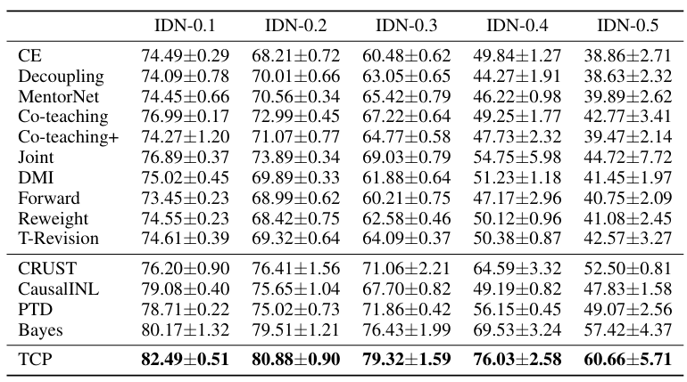

# A Time-Consistency Curriculum for Learning from Instance-Dependent Noisy Labels,
## Introduction
MindSpore is a new generation of full-scenario AI computing framework launched by Huawei in August 2019 and released On March 28, 2020.

This repository is a mindspore version implementation of the method proposed in paper *A Time-Consistency Curriculum for Learning from Instance-Dependent Noisy Labels* to deal with the challenge of *Instance-Dependent Noisy Labels*.

The method jointly training an *instance-dependent mapping* between the clean label posterior and the observed noisy label, and it contains a robust classifier that produces clean label posteriors.

## Performance
On *CIFAR10* with different label noise rates.


## Quick Start
1. Installation

    1.1 Git clone this repo

    ```
    git clone https://github.com/harryjun-ustc/MindFace.git
    ```

    1.2 Install dependencies

    ```
    pip install -r requirements.txt
    ```
2. Prepare dataset

    Three widely used datasets, **F-MNIST**, **SVHN** and **CIFAR10/100** is used.

    For all the datasets, 10% of the training data is left as a validation set. The final test model is selected with the highest validation accuracy.

3. Train

    ```
    python tools/train.py 
    ```

4. Evaluation

    ```
    python tools/eval.py
    ```

## Reference
```
@misc{
wu2023a,
title={A Time-Consistency Curriculum for Learning from Instance-Dependent Noisy Labels},
author={Songhua Wu and Tianyi Zhou and Yuxuan Du and Jun Yu and Bo Han and Tongliang Liu},
year={2023},
url={https://openreview.net/forum?id=4RwkbKZhGV}
}
```