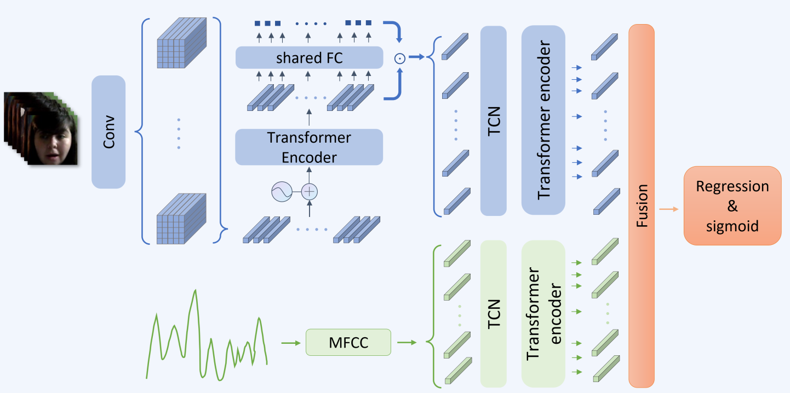

# A Dual Branch Network for Emotional Reaction Intensity Estimation in Mindspore


## Introduction
MindSpore is a new generation of full-scenario AI computing framework launched by Huawei in August 2019 and released On March 28, 2020.

Emotional Reaction Intensity(ERI) estimation is an important task in multimodal scenarios, and has fundamental applications in medicine, safe driving and other fields.

This repository is the mindspore implementation of the [award-winning](https://drive.google.com/file/d/1XMEai53mHl1Kkn4KnUS9AiL7yvAJ6ezD/view) solution for [the Fifth Field Emotional Behavior Analysis (ABAW) ERI Challenge](https://ibug.doc.ic.ac.uk/resources/cvpr-2023-5th-abaw/) and achieves excellent results on the official validation set. It is a video feature extraction model based on CNN and spatial attention, which can predict the reaction intensity of different emotions, including: Adoration, Amusement, Anxiety, Disgust, Empathic-Pain, Fear, Surprise. 

The spatial attention mechanism is used in the model to better extract visual features, and the Mel-Frequency Cepstral Coefficients technology extracts acoustic features, and a method named modality dropout is added to fusion multimodal features.

As shown in the figure below, on the basis of fusing local inter-frame information through temporal convolutional network, we use the temporal transformer to obtain the global temporal relationship, and use the MFCC to generate audio branch’s feature. Use a timing modeling method similar to video branch to obtain the global timing relationship. Finally, the features of the video and audio are fused into the prediction head to estimate the vector of emotional reaction intensity.）



## Updates
Comming soon!


## Hume-Reaction dataset Val Performance

Hume-Reaction dataset is a reaction of subjects from two cultures, South Africa and the United States, to emotional video stimuli. It consists of both audio and video parts and is recorded over approximately 75 hours. Corresponding label vector is self-annotated by the subjects and normalized to [0; 1] by its maximum intensity.
| Model | Audio | Video | $\overline{ρ}$ |
| :-- | :-: | :-: | :-: |
| [eGeMAPS](https://arxiv.org/abs/2303.01498) | √ | × | 0.0583 |
| [DeepSpectrum](https://arxiv.org/abs/2303.01498) | √ | × | 0.1087 |
| ours (only audio) | √ | × | 0.2972 |
| [FAU](https://arxiv.org/abs/2303.01498) | × | √ | 0.2840 |
| [VGGFACE2](https://arxiv.org/abs/2303.01498) | × | √ | 0.2488 |
| ours (only video) | × | √ | 0.3500 |
| [ViPER](https://dl.acm.org/doi/abs/10.1145/3551876.3554806) | √ | √ | 0.3025 |
| ours (both) | √ | √ | 0.4429 |


## Quick Start
1. Installation

    1.1 Git clone this repo

    ```
    git clone https://github.com/harryjun-ustc/MindFace.git
    ```

    1.2 Install dependencies

    ```
    pip install -r requirements.txt
    ```

2. Prepare Data

    2.1. Download the [Hume-Reaction dataset](https://www.hume.ai/products/dynamic-reaction)

    2.2. Organise the dataset directory under /audio_video/test_data as follows:
    ```
    audio_video/test_data/
        train/
        sample_32_train.txt
        val/
        sample_32_val.txt
        test/
        sample_32_test.txt
    ```
3. Set Config File

    You can Modify the parameters of the config file in ```audio_video/configs```.

4. Train


```
    python audio/train.py
    python video/train_seed.py
    python audio_video/train_seed.py
```

5. Predict
```
    python audio_video/test.py --batch_size 64
```


## References
- [A Dual Branch Network for Emotional Reaction Intensity Estimation](https://openaccess.thecvf.com/content/CVPR2023W/ABAW/html/Yu_A_Dual_Branch_Network_for_Emotional_Reaction_Intensity_Estimation_CVPRW_2023_paper.html)
```
@inproceedings{yu2023dual,
title={A dual branch network for emotional reaction intensity estimation},
author={Yu, Jun and Zhu, Jichao and Zhu, Wangyuan and Cai, Zhongpeng and Xie, Guochen and Li, Renda and Zhao, Gongpeng and Ling, Qiang and Wang, Lei and Wang, Cong and others},
booktitle={Proceedings of the IEEE/CVF Conference on Computer Vision and Pattern Recognition},
pages={5810--5817},
year={2023}
}
```

- [ABAW 5th Challenges](https://arxiv.org/abs/2303.01498)
```
@inproceedings{kollias2023abaw2,
title={Abaw: Valence-arousal estimation, expression recognition, action unit detection \& emotional reaction intensity estimation challenges},
author={Kollias, Dimitrios and Tzirakis, Panagiotis and Baird, Alice and Cowen, Alan and Zafeiriou, Stefanos},
booktitle={Proceedings of the IEEE/CVF Conference on Computer Vision and Pattern Recognition},
pages={5888--5897},
year={2023}}
```
