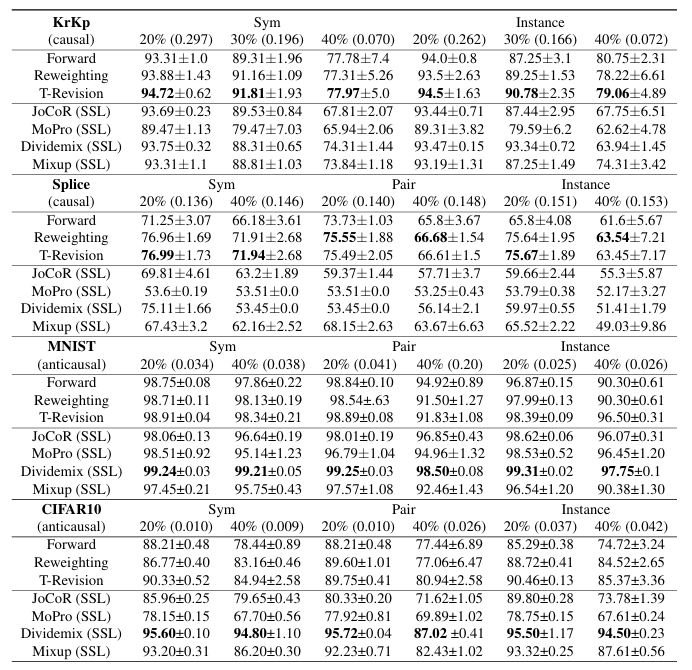

# Which is Better for Learning with Noisy Labels: The Semi-supervised Method or Modeling Label Noise
## Introduction
MindSpore is a new generation of full-scenario AI computing framework launched by Huawei in August 2019 and released On March 28, 2020.

This repository is a mindspore version implementation of the paper *Which is Better for Learning with Noisy Labels: The Semi-supervised Method or Modeling Label Noise*. An intuitive method to discover the causal structure for a given dataset containing label noise is propoosed in the paper.
## Experiment Results


## Quick Start
1. Installation

    1.1 Git clone this repo

    ```
    git clone https://github.com/harryjun-ustc/MindFace.git
    ```

    1.2 Install dependencies

    ```
    pip install -r requirements.txt
    ```
2. Prepare dataset
    Four datasets of two kinds (causal and anticausal) are used in experiments. They are **KrKp**, **Splice**, **MNIST** and **CIFAR10**. All of them can be download from their official site.

3. Train

    ```
    python tools/train.py 
    ```

4. Evaluation

    ```
    python tools/eval.py
    ```

## Reference
```
@InProceedings{pmlr-v202-yao23a,
  title = 	 {Which is Better for Learning with Noisy Labels: The Semi-supervised Method or Modeling Label Noise?},
  author =       {Yao, Yu and Gong, Mingming and Du, Yuxuan and Yu, Jun and Han, Bo and Zhang, Kun and Liu, Tongliang},
  booktitle = 	 {Proceedings of the 40th International Conference on Machine Learning},
  pages = 	 {39660--39673},
  year = 	 {2023},
  editor = 	 {Krause, Andreas and Brunskill, Emma and Cho, Kyunghyun and Engelhardt, Barbara and Sabato, Sivan and Scarlett, Jonathan},
  volume = 	 {202},
  series = 	 {Proceedings of Machine Learning Research},
  month = 	 {23--29 Jul},
  publisher =    {PMLR},
  pdf = 	 {https://proceedings.mlr.press/v202/yao23a/yao23a.pdf},
  url = 	 {https://proceedings.mlr.press/v202/yao23a.html},
  abstract = 	 {In real life, accurately annotating large-scale datasets is sometimes difficult. Datasets used for training deep learning models are likely to contain label noise. To make use of the dataset containing label noise, two typical methods have been proposed. One is to employ the semi-supervised method by exploiting labeled <em>confident examples</em> and unlabeled <em>unconfident examples</em>. The other one is to <em>model label noise</em> and design <em>statistically consistent</em> classifiers. A natural question remains unsolved: which one should be used for a specific real-world application? In this paper, we answer the question from the perspective of <em>causal data generative process</em>. Specifically, the performance of the semi-supervised based method depends heavily on the data generative process while the method modeling label-noise is not influenced by the generation process. For example, for a given dataset, if it has a causal generative structure that the features cause the label, the semi-supervised based method would not be helpful. When the causal structure is unknown, we provide an intuitive method to discover the causal structure for a given dataset containing label noise.}
}
```