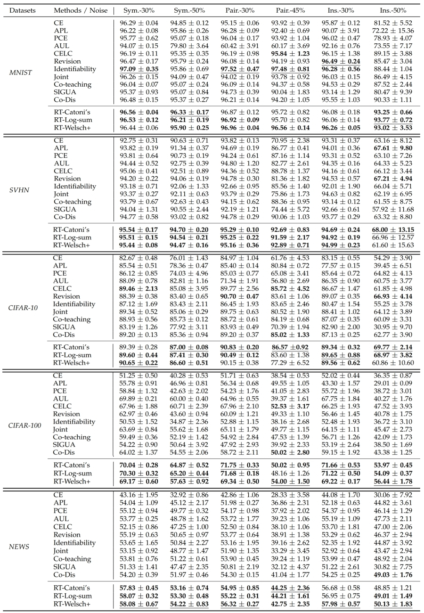

# Regularly Truncated M-estimators for Learning with Noisy Labels(RTM_LNL) in MindSpore


## Introduction
MindSpore is a new generation of full-scenario AI computing framework launched by Huawei in August 2019 and released On March 28, 2020.

This repository provides a MindSpore implementation for a method called Regular Truncation M-Estimation, which can better learn with noisy labels. Currently, we have released the code on four datasets, including MNIST, CIFAR-10, CIFAR-100, SVHN and NEWS. Theoretically, it is demonstrated that these strategies are label-noise-tolerant. Empirically, comprehensive experimental results show that this method can outperform multiple baselines and is robust to broad noise types and levels.

The sample selection approach is very popular in learning with noisy labels. As deep networks "learn pattern first", prior methods built on sample selection share a similar training procedure: the small-loss examples can be regarded as clean examples and used for helping generalization, while the large-loss examples are treated as mislabeled ones and excluded from network parameter updates.
However, such a procedure is arguably debatable from two folds: 
1. it does not consider the bad influence of noisy labels in selected small-loss examples;
2. it does not make good use of the discarded large-loss examples, which may be clean or have meaningful information for generalization.

So, [this paper](https://ieeexplore.ieee.org/abstract/document/10375792) proposes regularly truncated M-estimators (RTME) to address the above two issues simultaneously. Specifically, RTME can alternately switch modes between truncated M-estimators and original M-estimators. The former can adaptively select small-losses examples without knowing the noise rate and reduce the side-effects of noisy labels in them. The latter makes the possibly clean examples but with large losses involved to help generalization.


## Updates
Comming soon!


## Performance
We verify the effectiveness of our methods on the manually corrupted version of the following datasets: [MNIST](http://yann.lecun.com/exdb/mnist/), [SVHN](http://ufldl.stanford.edu/housenumbers/), [CIFAR-10](https://www.cs.toronto.edu/~kriz/cifar.html), [CIFAR-100](https://www.cs.toronto.edu/~kriz/cifar.html), and [NEWS](https://www.sciencedirect.com/science/article/abs/pii/B9781558603776500487), because these datasets are popularly used for the evaluation of learning with noisy labels in the literature. For NEWS, we borrowed the pre-trained word embeddings from [GloVe](https://nlp.stanford.edu/projects/glove/). 

We consider two kinds of classdependent label noise and one kind of instance-dependent label noise here:
1. Symmetric noise (abbreviated as Sym.): this kind of label noise is generated by flipping labels in each class uniformly to incorrect labels of other classes. 
2. Pairflip noise (abbreviated as Pair.): the noise flips each class to its adjacent class. 
3. Instance noise (abbreviated as Ins.): the noise is quite realistic, where the probability that an instance is mislabeled depends on its instances/features.

The following table shows the mean and standard deviations of test accuracy (%) on synthetic MNIST, SVHN, CIFAR-10, CIFAR-100, and NEWS. The best 3 experimental results are in bold while the best is underlined.



## Quick Start

1. Installation

    1.1 Git clone this repo

    ```
    git clone https://github.com/harryjun-ustc/MindFace.git
    ```

    1.2 Install dependencies

    ```
    pip install -r requirements.txt
    ```


2. Prepare the Noisy Data

    2.1. Download the [MNIST](http://yann.lecun.com/exdb/mnist/), [CIFAR-10 and CIFAR-100](https://www.cs.toronto.edu/~kriz/cifar.html), [SVHN](http://ufldl.stanford.edu/housenumbers/), [NEWS](https://www.sciencedirect.com/science/article/abs/pii/B9781558603776500487)

    2.2. Set option file `./config/cifar10.json`
   

4. Set Option File

    You can Modify the parameters of the config file in ```./option.py```.
  
    
5. Test

    To run the experiments for rtcatoni on mnist with 30% symmetric label noise, run 

    `python main.py --loss rtcatoni --noise_type symmetric --noise_rate 30 --dataset mnist`

    result will be saved in `./results/results.csv`

    The loss options for our method is rtcatoni, rtwelschp, rtlogsum.

    The noise type options is symmetric, pairflip, ILN.

    The noise rate options is 30, 50 but 45 for pairflip.


## References
- [Regularly Truncated M-estimators for Learning with Noisy Labels](https://ieeexplore.ieee.org/abstract/document/10375792)
```
@ARTICLE{10375792,
author={Xia, Xiaobo and Lu, Pengqian and Gong, Chen and Han, Bo and Yu, Jun and Yu, Jun and Liu, Tongliang},
journal={IEEE Transactions on Pattern Analysis and Machine Intelligence}, 
title={Regularly Truncated M-Estimators for Learning With Noisy Labels}, 
year={2023},
volume={},
number={},
pages={1-15},
keywords={Noise measurement;Training;Training data;Computer science;Switches;Random variables;Australia;Generalization;learning with noisy labels;regularly truncated m-estimators;sample selection;truncated m-estimators},
doi={10.1109/TPAMI.2023.3347850}}
```
