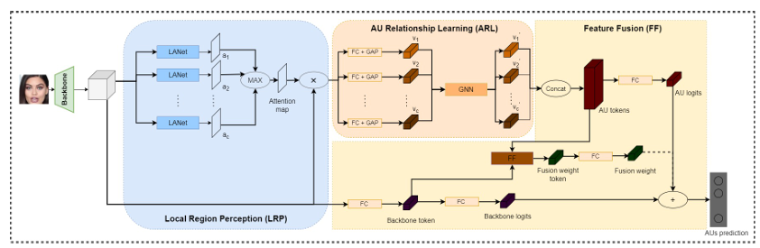
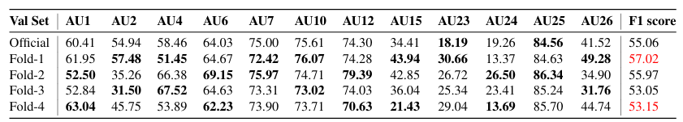

# Local Region Perception and Relationship Learning Combined with Feature Fusion 
## Introduction
MindSpore is a new generation of full-scenario AI computing framework launched by Huawei in August 2019 and released On March 28, 2020.

This repository is a mindspore implementation of the submission to the CVPR 2023 competition on *Affective Behaviour Analysis in-the-wild* (ABAW)


## Performance


## Quick Start
1. Installation

    1.1 Git clone this repo

    ```
    git clone https://github.com/harryjun-ustc/MindFace.git
    ```

    1.2 Install dependencies

    ```
    pip install -r requirements.txt
    ```
2. Prepare dataset

    For this challenge, the Aff-Wild2 dataset is used. The Aff-wild2 is extended from Aff-wild1.
    
    You can download the dataset from the official site of ABAW.

3. Train

    ```
    python tools/train.py 
    ```

4. Evaluation

    ```
    python tools/eval.py
    ```

## Pretrained Model
We will soon post the pretrained used in competition.

## Reference
  ```
  @inproceedings{10208927,
  author={Yu, Jun and Li, Renda and Cai, Zhongpeng and Zhao, Gongpeng and Xie, Guochen and Zhu, Jichao and Zhu, Wangyuan and Ling, Qiang and Wang, Lei and Wang, Cong and Qiu, Luyu and Zheng, Wei},
  booktitle={2023 IEEE/CVF Conference on Computer Vision and Pattern Recognition Workshops (CVPRW)}, 
  title={Local Region Perception and Relationship Learning Combined with Feature Fusion for Facial Action Unit Detection}, 
  year={2023},
  volume={},
  number={},
  pages={5785-5792},
  keywords={Human computer interaction;Gold;Fuses;Face recognition;Feature extraction;Sampling methods;Graph neural networks},
  doi={10.1109/CVPRW59228.2023.00614}}
  ```